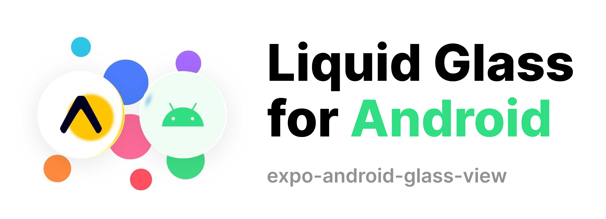
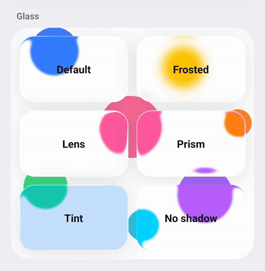
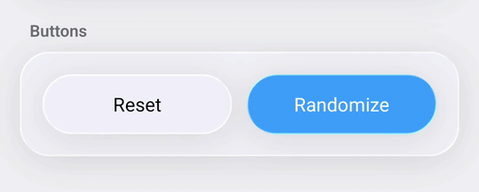
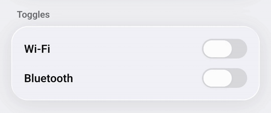
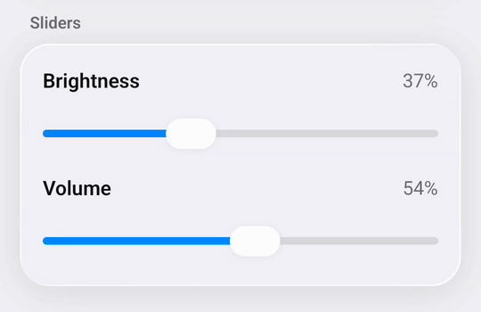
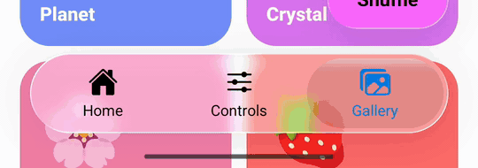

<p align="center">
  
</p>

#

Liquid Glass for React Native on **Android**: real refraction, blur, vibrancy and rim
highlights behind any React content, rendered with Jetpack Compose — plus ready-made glass
buttons, toggles, sliders and a bottom tab bar.

The glass effects and the components come from
[Kyant0/AndroidLiquidGlass](https://github.com/Kyant0/AndroidLiquidGlass). The part that lets
the glass see the React Native screen behind it is adapted from
[QWEA0/Liquid-Glass-Android](https://github.com/QWEA0/Liquid-Glass-Android).

> **Status:** 0.1, the first release. APIs may still change before 1.0.

```tsx
import {
  AndroidGlassView,
  AndroidGlassButton,
  AndroidGlassToggle,
  AndroidGlassSlider,
  AndroidGlassBottomTabs,
  AndroidGlassTab,
  MinimizeOnScrollProvider,
  useMinimizeOnScrollHandler,
  useMinimizeOnScroll,
} from 'expo-android-glass-view';
```

No wrapper or provider is needed: every glass component samples whatever is drawn behind it in
the same window, and keeps up with scrolling lists, animations and layout changes.

## Platforms

| Platform               | Result                                                        |
| ---------------------- | ------------------------------------------------------------- |
| Android 13+ (API 33)   | Full effect: refraction, chromatic aberration, blur, vibrancy |
| Android 12 (API 31–32) | Blur and vibrancy, no refraction (needs AGSL runtime shaders) |
| Android 11 and older   | Plain translucent surface (`fallbackColor`)                   |
| iOS, web               | Same components, plain fallbacks with the same API — no crash |

Requires a development build (it is a native module, so it does not run in Expo Go) and the
React Native New Architecture. Built against Expo SDK 57 / React Native 0.86.

## Installation

```sh
npx expo install expo-android-glass-view
npx expo run:android
```

For bare React Native apps, [install Expo Modules](https://docs.expo.dev/bare/installing-expo-modules/) first.

## `AndroidGlassView`

A container: children render on top of the glass and stay fully interactive.

```tsx
<AndroidGlassView style={{ padding: 20 }} cornerRadius={24}>
  <Text>Anything</Text>
</AndroidGlassView>
```



Accepts every `View` prop plus:

| Prop                  | Type         | Default                         | Description                                                                           |
| --------------------- | ------------ | ------------------------------- | ------------------------------------------------------------------------------------- |
| `cornerRadius`        | `number`     | `style.borderRadius`, else `24` | Corner radius of the glass shape in dp. Use a large value (e.g. `999`) for a capsule. |
| `blurRadius`          | `number`     | `2`                             | Backdrop blur in dp. `0` disables it.                                                 |
| `refractionHeight`    | `number`     | `12`                            | Width of the refracting rim in dp. `0` disables refraction.                           |
| `refractionAmount`    | `number`     | `24`                            | How far content is bent at the rim, in dp.                                            |
| `chromaticAberration` | `boolean`    | `false`                         | Split the refraction per colour channel (prism fringe).                               |
| `depthEffect`         | `boolean`    | `false`                         | Stronger, depth-like bending towards the rim.                                         |
| `vibrancy`            | `boolean`    | `true`                          | Boost the saturation of what is behind the glass.                                     |
| `highlight`           | `boolean`    | `true`                          | Specular highlight along the rim.                                                     |
| `shadow`              | `boolean`    | `true`                          | Soft drop shadow around the shape.                                                    |
| `tintColor`           | `ColorValue` | —                               | Colour tint mixed into the glass.                                                     |
| `surfaceColor`        | `ColorValue` | —                               | Flat colour painted over the glass, on top of the refraction.                         |
| `fallbackColor`       | `ColorValue` | `rgba(255,255,255,0.7)`         | Surface used where the effect cannot run (see _Platforms_).                           |

Don't set `backgroundColor` on a glass view — it would paint over the effect. Use `tintColor`
or `surfaceColor` instead.

## `AndroidGlassButton`

Kyant's liquid button: while pressed, the glass swells, stretches towards the finger and a
highlight follows it.



```tsx
<AndroidGlassButton title="Save" onPress={save} />
<AndroidGlassButton title="Continue" tintColor="#0088FF" onPress={next} />
<AndroidGlassButton surfaceColor="rgba(255, 255, 255, 0.3)" onPress={share}>
  <Ionicons name="share-outline" size={18} />
  <Text>Share</Text>
</AndroidGlassButton>
```

Takes every `AndroidGlassView` prop (`cornerRadius` defaults to a capsule) plus:

| Prop          | Type         | Default | Description                                          |
| ------------- | ------------ | ------- | ---------------------------------------------------- |
| `onPress`     | `() => void` | —       | Called on tap.                                       |
| `title`       | `string`     | —       | Convenience label (15 sp; white on a tinted button). |
| `titleStyle`  | `TextStyle`  | —       | Style for `title`.                                   |
| `interactive` | `boolean`    | `true`  | Press and drag deformation.                          |

The default size is 48 dp high with 16 dp horizontal padding; override it with `style`. The
children are drawn _inside_ the glass (clipped to it, deformed with it), so they are decorative:
don't put interactive elements in a button.

## `AndroidGlassToggle`



```tsx
<AndroidGlassToggle value={enabled} onValueChange={setEnabled} />
```

| Prop            | Type                       | Default          | Description                                                   |
| --------------- | -------------------------- | ---------------- | ------------------------------------------------------------- |
| `value`         | `boolean`                  | `false`          |                                                               |
| `onValueChange` | `(value: boolean) => void` | —                | Called on tap or when the thumb is dropped on the other side. |
| `accentColor`   | `ColorValue`               | iOS green        | Track colour when on.                                         |
| `trackColor`    | `ColorValue`               | translucent grey | Track colour when off.                                        |

The track is 64 × 28 dp; the thumb turns into refracting glass and grows past it while dragged.

Use it controlled (`value` + `onValueChange`). A `value` prop only wins once JS has handled every
change made on the switch, so quick taps never make it flicker; if `onValueChange` doesn't take the
new value, the switch returns to `value`.

## `AndroidGlassSlider`



```tsx
<AndroidGlassSlider value={volume} maximumValue={100} onValueChange={setVolume} />
```

| Prop                            | Type                      | Default          | Description                                                    |
| ------------------------------- | ------------------------- | ---------------- | -------------------------------------------------------------- |
| `value`                         | `number`                  | `0`              |                                                                |
| `minimumValue` / `maximumValue` | `number`                  | `0` / `1`        |                                                                |
| `onValueChange`                 | `(value: number) => void` | —                | Called continuously while dragging.                            |
| `onSlidingComplete`             | `(value: number) => void` | —                | Called when the finger is lifted, or after a tap on the track. |
| `accentColor`                   | `ColorValue`              | system blue      | Filled part of the track.                                      |
| `trackColor`                    | `ColorValue`              | translucent grey | Unfilled part of the track.                                    |

It stretches to the width of its parent and is 36 dp high by default.

Use it controlled (`value` + `onValueChange`). While a finger is on the slider it is driven
natively, and after that a `value` prop only wins once JS has handled every event the slider sent
(the handshake React Native's `TextInput` uses). So an older value never pulls the thumb back, even
on a slow JS thread, and a value you set in `onSlidingComplete` (a rounded one, say) still wins.

## `AndroidGlassBottomTabs` and `AndroidGlassTab`

Kyant's iOS 26 style tab bar: a glass capsule with a liquid selection droplet you can drag
between tabs. Under the droplet the tab content takes the accent colour and is magnified while
pressed.



```tsx
<AndroidGlassBottomTabs
  selectedIndex={tab}
  onTabSelected={setTab}
  style={{ position: 'absolute', left: 24, right: 24, bottom: 32 }}>
  <AndroidGlassTab label="Home" icon={<Ionicons name="home" size={24} />} />
  <AndroidGlassTab label="Search" icon={<Ionicons name="search" size={24} />} />
  <AndroidGlassTab label="Profile" icon={<Ionicons name="person" size={24} />} />
</AndroidGlassBottomTabs>
```

| Prop                | Type                           | Default           | Description                                                                                 |
| ------------------- | ------------------------------ | ----------------- | ------------------------------------------------------------------------------------------- |
| `selectedIndex`     | `number`                       | `0`               |                                                                                             |
| `onTabSelected`     | `(index: number) => void`      | —                 | Called on tap, or when the droplet is dropped on a tab.                                     |
| `minimized`         | `boolean`                      | `false`           | Minimized look: shorter and narrower, labels faded out. Animated. See _Minimize on scroll_. |
| `onMinimizedChange` | `(minimized: boolean) => void` | —                 | Called with `false` when the user expands the minimized bar by touching it.                 |
| `accentColor`       | `ColorValue`                   | system blue       | Colour of the selected tab's content.                                                       |
| `containerColor`    | `ColorValue`                   | translucent white | Colour of the glass bar.                                                                    |

Each child is one tab (equal widths). `AndroidGlassTab` is an icon over a 12 sp label, but any
view works — as with buttons, the tabs are drawn inside the glass, so keep them decorative. The
bar is 64 dp high by default.

Use it controlled (`selectedIndex` + `onTabSelected`). A `selectedIndex` prop only wins once JS has
handled every selection made on the bar, so on quick taps or a busy JS thread the droplet never
jumps back to a tab the user already left. If `onTabSelected` doesn't take the new index, the
droplet returns to `selectedIndex`.

### Minimize on scroll

Like iOS 26 tab bars, the bar can shrink while the user scrolls down a list, and come back when
they scroll up, get back to the top or touch it. It gets shorter and narrower; every tab keeps its
first child (the icon) while the rest (the label) fades out.

Wrap the bar and the screens in `MinimizeOnScrollProvider`, and give each list the handler from
`useMinimizeOnScrollHandler`:

```tsx
<MinimizeOnScrollProvider>
  {/* your navigator, or screens + AndroidGlassBottomTabs */}
</MinimizeOnScrollProvider>

// In any screen:
const onScroll = useMinimizeOnScrollHandler();
<FlatList onScroll={onScroll} scrollEventThrottle={16} … />
```

Inside the provider, `AndroidGlassBottomTabs` follows the shared state by itself (unless you pass
`minimized`). Each list tracks its own scroll position, and a screen isn't re-rendered when the
bar minimizes. The scroll position is read in JS, where the list lives; only the resulting flag
goes to the native side, where the animation runs. Any list that reports `onScroll` works
(ScrollView, FlatList, SectionList, FlashList…); if you already have an `onScroll`, call the
handler from it.

When the list and the bar are in the same component, `useMinimizeOnScroll` alone is enough:

```tsx
const { minimized, setMinimized, onScroll } = useMinimizeOnScroll();

<ScrollView onScroll={onScroll} scrollEventThrottle={16}>…</ScrollView>
<AndroidGlassBottomTabs minimized={minimized} onMinimizedChange={setMinimized} …>…</AndroidGlassBottomTabs>
```

The iOS and web fallbacks don't minimize; there, `useMinimizeOnScrollHandler` returns `undefined`.

### With Expo Router or React Navigation

The bar doesn't navigate by itself: use it as the navigator's `tabBar`, driven by the navigation
state. Tap vetoes (`tabPress` with `preventDefault`) send the droplet back.

```tsx
import { Tabs } from 'expo-router';
import type { BottomTabBarProps } from 'expo-router/js-tabs';
import { StyleSheet } from 'react-native';
import {
  AndroidGlassBottomTabs,
  AndroidGlassTab,
  MinimizeOnScrollProvider,
} from 'expo-android-glass-view';

function GlassTabBar({ state, descriptors, navigation }: BottomTabBarProps) {
  // Routes hidden with `href: null` reach a custom bar as `display: 'none'`.
  const routes = state.routes.filter(
    (route) =>
      StyleSheet.flatten(descriptors[route.key].options.tabBarItemStyle)?.display !== 'none'
  );
  const focusedKey = state.routes[state.index].key;
  return (
    <AndroidGlassBottomTabs
      selectedIndex={routes.findIndex((route) => route.key === focusedKey)}
      onTabSelected={(index) => {
        const route = routes[index];
        const event = navigation.emit({
          type: 'tabPress',
          target: route.key,
          canPreventDefault: true,
        });
        if (!event.defaultPrevented) navigation.navigate(route.name, route.params);
      }}
      style={{ position: 'absolute', left: 24, right: 24, bottom: 32 }}>
      {routes.map((route) => {
        const { options } = descriptors[route.key];
        return (
          <AndroidGlassTab
            key={route.key}
            label={options.title ?? route.name}
            // The droplet tints the selected tab, so draw icons in one neutral colour.
            icon={options.tabBarIcon?.({ focused: false, color: '#000000', size: 24 })}
          />
        );
      })}
    </AndroidGlassBottomTabs>
  );
}

export default function TabLayout() {
  return (
    <MinimizeOnScrollProvider>
      <Tabs tabBar={(props) => <GlassTabBar {...props} />} />
    </MinimizeOnScrollProvider>
  );
}
```

The bar floats over the screens, so give their content some bottom padding. With React
Navigation, the same component works as `createBottomTabNavigator`'s `tabBar`.

## Colours and dark mode

Component defaults (accent, track and container colours) follow the system dark mode setting,
like Kyant's samples. Pass the colour props to match your own theme.

## Gestures

The components look exactly like Kyant's samples, but take touches over a larger area:

- **Slider:** pressing anywhere on it moves the thumb under the finger (Kyant's sample only drags
  the thumb and jumps on taps).
- **Tab bar:** a tap selects the tab under the finger, like Kyant's sample. A horizontal drag that
  starts anywhere on the bar pulls the droplet under the finger and scrubs between tabs; releasing
  selects the nearest tab. Dragging the droplet itself works as before.
- **Toggle:** the whole switch takes taps and drags, not only the thumb.

Toggles, sliders and the tab bar also claim horizontal drags: once a drag on them turns out to be
horizontal, a parent `ScrollView` no longer takes it over, and React Native's JS touch handlers
are told a native gesture started. Vertical drags still scroll.

## How it works

Each glass view is a React Native view whose first child is a Compose view drawing Kyant's
`drawBackdrop` modifier. Its backdrop is not a Compose layer but the Android view tree of the
window — i.e. your React Native screen:

1. Every container on the path from the window root to a glass view is drawn with the public
   `View.draw()`, with glass views (and branches containing them) hidden for that call.
2. Every other subtree is recorded as a reference to its RenderNode, so when a list scrolls or a
   view animates, the glass picks it up without re-sampling.
3. Glass views don't sample other glass views, except their own ancestors: a toggle on a glass
   card sees the card. This rules out RenderNode cycles (glass A → glass B → glass A).
4. The capture is recorded once into a RenderNode with its own GPU layer, and only recorded again
   when the glass moves, something scrolls or glass views come and go. Every glass layer of a view
   (the tab bar has three) samples that same texture, so pressing or dragging only re-runs the
   glass effects, not the capture.

## Limitations

- **Glass does not show other glass views** behind it, unless it sits inside them.
- Inside a container that holds a glass view, branches containing glass are drawn after their
  siblings in the backdrop, so z-order can differ from the screen in that case.
- `SurfaceView`-based content (most video players, camera previews, some maps) is not part of the
  view tree's drawing and shows up empty behind the glass. `TextureView` content works.
- A React Native `Modal` is a separate window, so glass inside it only sees the modal's content.

## Credits and licenses

This package is licensed under Apache-2.0. It contains code from
[Kyant0/AndroidLiquidGlass](https://github.com/Kyant0/AndroidLiquidGlass) (Apache-2.0) and
[QWEA0/Liquid-Glass-Android](https://github.com/QWEA0/Liquid-Glass-Android) (MIT); see
[THIRD_PARTY_NOTICES.md](./THIRD_PARTY_NOTICES.md).
